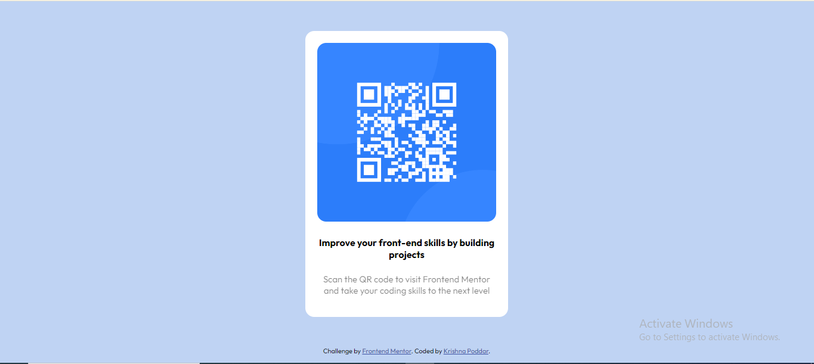

# Frontend Mentor - QR code component solution

This is a solution to the [QR code component challenge on Frontend Mentor](https://www.frontendmentor.io/challenges/qr-code-component-iux_sIO_H). Frontend Mentor challenges help you improve your coding skills by building realistic projects. 

## Table of contents

- [Overview](#overview)
  - [Screenshot](#screenshot)
  - [Links](#links)
- [My process](#my-process)
  - [What I learned](#what-i-learned)
  - [Continued development](#continued-development)
- [Author](#author)

## Overview

### Screenshot

### Links

- Solution URL: [Add solution URL here](https://github.com/KrishnaPoddar1/QRCodeComponent.git)
- Live Site URL: [Add live site URL here]( https://krishnapoddar1.github.io/QRCodeComponent/)

## My process

I used a very simple approach by using a container and then I styles the container as per the requirment.
There was no issues or problems that I faced during this development.

### What I learned

Learned how to make a card element which can be used over and over again.

### Continued development

Would love to build using a flexbox or a grid component. 

## Author

- Frontend Mentor - [@KrishnaPoddar1](https://www.frontendmentor.io/profile/KrishnaPoddar1)

